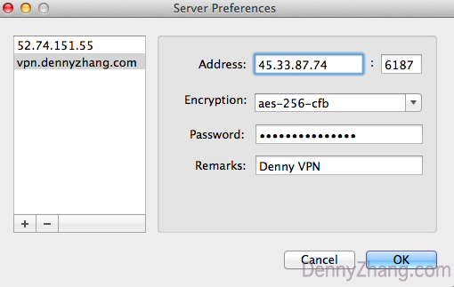

# Basic Intro
<a href="https://github.com/DennyZhang?tab=followers"></a>

- [](https://www.linkedin.com/in/dennyzhang001) [](https://github.com/DennyZhang) [](https://twitter.com/dennyzhang001) [](https://goo.gl/ozDDyL)

Docker shadowsocks VPN via docker

1. Read and understand basic usage of Shadowsocks: [link](https://shadowsocks.org/en/index.html)
2. Deploy Shadowsocks server in your VM via docker-compose.

```
git clone https://github.com/DennyZhang/shadowsocks-vpn-docker.git
cd shadowsocks-vpn-docker
docker-compose up -d
```

3. Connect to your VPN server from client machines

```
 Server: $YOUR_SERVER_IP
 Port: 6187
 Password: DamnGFW
```

Default configuration is [shadowsocks.json](./shadowsocks.json)

Screenshot:



- [](https://hub.docker.com/r/denny/shadowsocks-vpn-docker/) [](http://makeapullrequest.com)

- File me [tickets](https://github.com/DennyZhang/shadowsocks-vpn-docker/issues) or star [the repo](https://github.com/DennyZhang/shadowsocks-vpn-docker).

# License
- Code is licensed under [MIT License](https://www.dennyzhang.com/wp-content/mit_license.txt).
